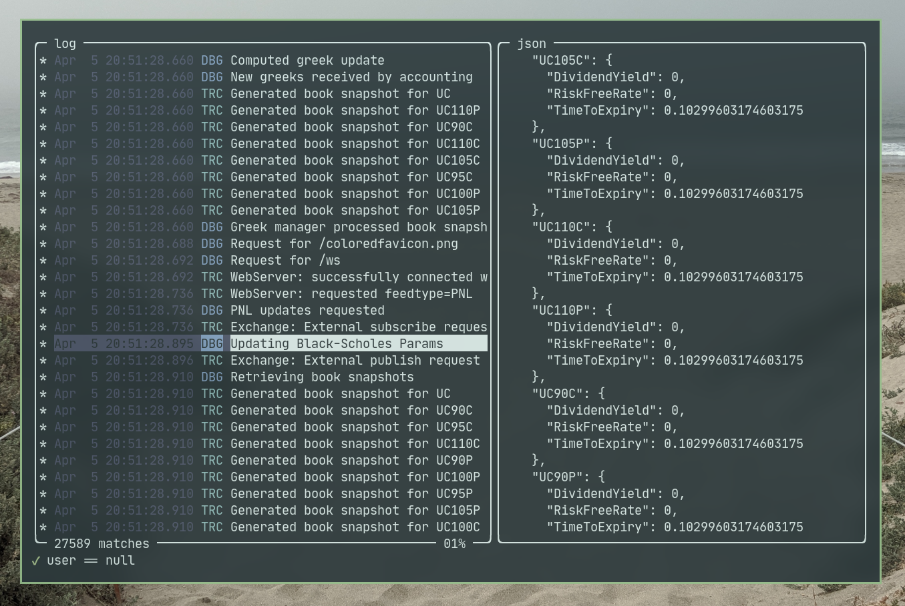

# jlv
A TUI JSON log viewer written in Go.



## Motivation
While working on the 2021 UChicago Trading Competition, I realized that it would be important to
have verbose, meaningful logs that could be used to identify bugs/other strange behavior experienced
by competitors. I settled on JSON logging as a good way to add lots of structure/metadata to these
logs, but I found that most JSON log viewers were either graphical/messy or extremely minimal.

This viewer was made in order to allow for exploratory analysis of JSON logs under roughly 100k
lines. It allows for relatively fast, human-readable filtering using
[antonmedv/expr](https://github.com/antonmedv/expr), and strives to have sane behavior as much as
possible.

## Installation/Usage
To install,
```sh
$ go get -u github.com/quid256/jlv
```

To open a logfile for viewing,
```sh
$ jlv <file>
```

The usage is listed in the below table because I'm too busy to make a help menu rn:

When in "normal mode" (the mode you will be in when actually exploring logs), the keys are as follows
| Key         | Action                          |
|-------------|---------------------------------|
| j, \<down\> | Scroll down in the log pane     |
| k, \<up\>   | Scroll up in the log pane       |
| J           | Page down in log pane           |
| K           | Page up in log pane             |
| G           | Scroll to bottom of log         |
| g           | Scroll to top of log            |
| u           | Scroll down in the JSON pane    |
| i           | Scroll up in JSON pane          |
| h           | Shrink log pane, grow JSON pane |
| l           | Grow log pane, shrink JSON pane |
| /, :        | Enter filter mode               |
| Ctrl+C      | Exit                            |

When in "filter mode", you can type a filter at the bottom of the screen. Press Esc to cancel or
Enter to submit. The status of the filter is listed to the right:
 - If the icon is a check, then the filter ran successfully and the results are being displayed in
   the log pane
 - If the icon is an X, then the filter failed and the log is displayed with no filter applied
 - If the icon is a ?, then the filter text at the bottom does not accurately represent the applied
   filter (happens when you Esc while writing a filter) or there is no filter applied at all.

## Notes/known issues
 - Odd behavior when filtering on a field that doesn't necessarily exist in the structure
 - Nord color scheme (not sure how to change it to match terminal scheme with TCell)
 - Takes some time to load odd files (maybe some form of lazy loading could be used?)